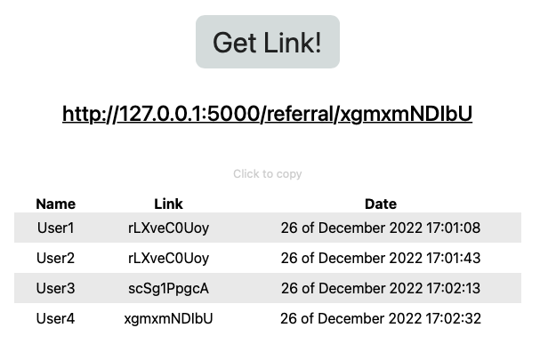

# referralLinks
Веб-сайт на фреймворке Flask

### Функционал:

**- Авторизация пользователей** 

Регистрация пользователя;

Авторизация пользователя;

Выход из учетной записи пользователя.

 

**- Реферальные ссылки** 

Генерация уникальных для пользователя реферальных ссылок;

Новые пользователи, которые зарегистрировались по реферальной ссылке, относятся к ее владельцу - пользователю, который создал ссылку. Также они не могут относиться к нескольким владельцам реферальных ссылок;

Владелец реферальной ссылки видит, по каким ссылкам присоединились пользователи, а также когда они зарегистрировались.

